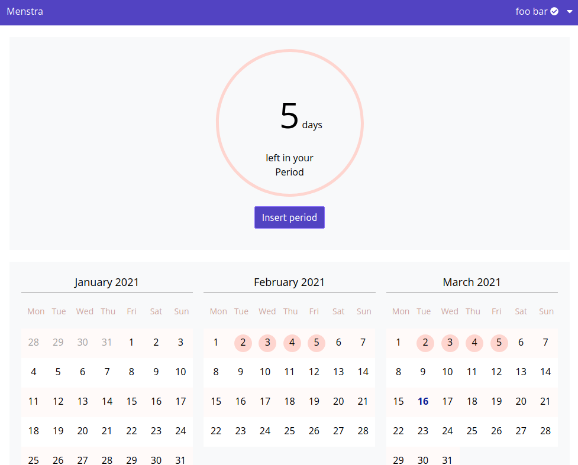

# Tower of Fate

> The tower contains many valuable artifacts and tomes, both magical and non-magical, that Fate has collected through
>the millennia.

A [_Monorepo_](https://en.wikipedia.org/wiki/Monorepo) that holds a _frontend_ and a _backend_ to safely manage your
complete menstruation cycle in a safe and data privacy concerned manner.

This is a project for the Medical Computer Science major at the Beuth Hochschule für Technik Berlin.

The deployed version can be found here: https://menstra.herokuapp.com

## Pipeline
The project was built with [CI](https://martinfowler.com/articles/continuousIntegration.html) / [CD](https://azure.microsoft.com/en-us/overview/continuous-delivery-vs-continuous-deployment/). For this project we are using continuous deployment.
There is a [circle-ci pipeline](https://app.circleci.com/pipelines/github/meandor/tower-of-fate) that takes care of most
of the automation. To learn more about delivery pipelines please visit: https://martinfowler.com/bliki/DeploymentPipeline.html

## Deployment
The project is deployed in the AWS Cloud with [Heroku](https://dashboard.heroku.com/pipelines/d2d0bc61-3d2d-452a-824a-45daa4ed3a11).
It is using the free tier, which means that initially the project might load a bit but should then work as expected.

### Staging
Both frontend and backend are deployed on the staging environment (please check Heroku).
To visit staging: https://menstra-staging.herokuapp.com/

### Live
Both frontend and backend are deployed on the production environment (please check Heroku).
To visit production: https://menstra.herokuapp.com/

## Prerequisites
### Frontend
* [Node.js / npm](https://nodejs.org/en/download/)

### Backend
* [JDK 8 or JDK 11](https://adoptopenjdk.net/installation.html)
* [SBT](https://www.scala-sbt.org/1.x/docs/Setup.html)
* [Docker](https://docs.docker.com/desktop/) (if you want to run integration tests)
